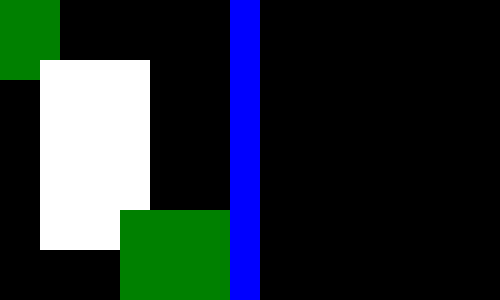

The goal of this project was to simulate wildfires given a text file representing an aerial view.
 
- Image: representing an image as a one dimensional array to store our pixels.
- Analyst: able to detect how many zones are in an image, return sets of pixels of a same zone by using a unionFind approach for optimal results with large images and the floodFill algorithm for smaller tasks.
- FireSimulator: simulates a wildfire when given a starting point.

Here are results on two simulations I did. The left one being a simple forest and the right one being a mix between a river, roads, forests.

